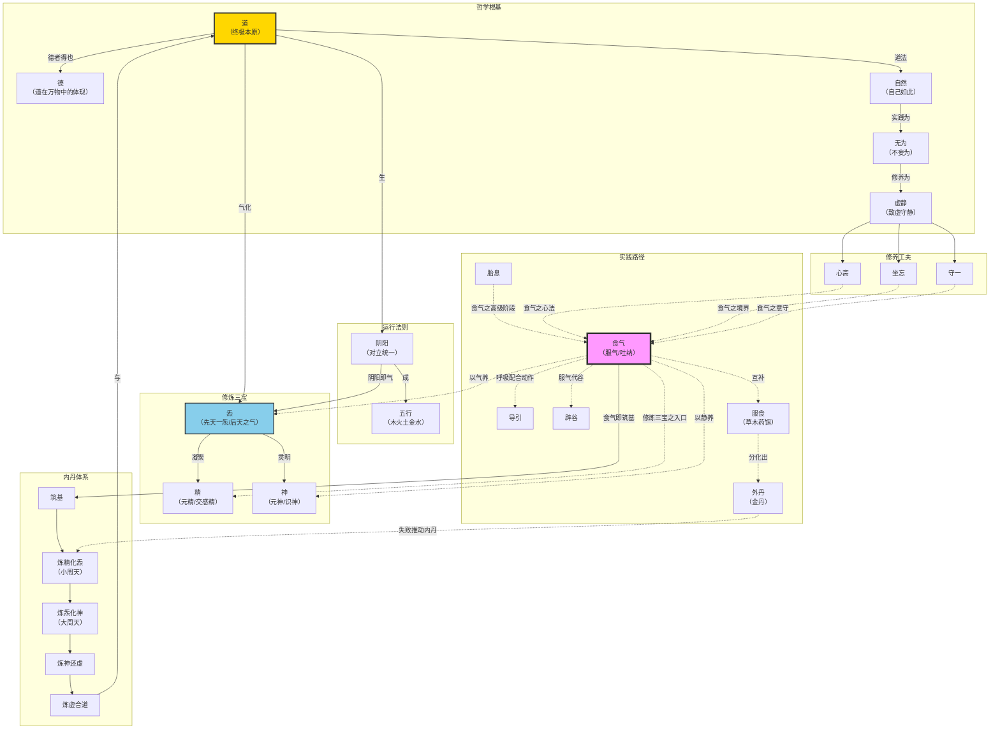

# 道家核心概念全谱系 —— 从道到丹的终极体系

## 概述

道家思想是中国哲学中最具原创力的体系之一，其概念网络横跨形而上学、宇宙论、养生学、政治哲学和宗教实践五大领域。与佛教的"空"、儒家的"仁"不同，道家以**「道」为最高范畴，以「气」为贯通媒介，以「修」为实践路径**，构建了一个从宇宙本原到个体修炼的完整闭环。

本文以超深度研究方式，系统梳理道家所有核心概念及其内在关系，并将「食气」放入整个体系中精确定位——食气既是阴阳五行在呼吸中的具体应用，又是精炁神三宝的修炼入口，更是内丹筑基的核心手段。

---

## 第一章：道与德 —— 根本基石

### 1.1 「道」的五个层次含义

在老子《道德经》中，「道」字出现73次，含义丰富多歧。综合历代注家（河上公、王弼、成玄英、吴澄、王夫之）的解读，"道"可析为五个层次：

| 层次 | 名称 | 含义 | 典型原文 |
|------|------|------|----------|
| 第一层 | **本原之道** | 宇宙万物的终极来源，先天地而生，为万物之母 | "有物混成，先天地生……可以为天地母"（第25章） |
| 第二层 | **规律之道** | 万物运行的根本法则，对立统一、循环往复 | "反者道之动，弱者道之用"（第40章） |
| 第三层 | **境界之道** | 体道者所达到的精神境界，与道合一 | "孔德之容，惟道是从"（第21章） |
| 第四层 | **方法之道** | 为人处世、治国养生的实践准则 | "人法地，地法天，天法道，道法自然"（第25章） |
| 第五层 | **言说之道** | 言说、表述（"道"字的原始义） | "道可道，非常道"（第1章） |

> 这五层含义并非孤立——老子正是利用了"道"作为"言说"的原始义，在第一句"道可道，非常道"中完成了一个精妙的语义翻转：可以说出来的"道"，就不是那个作为本原的"常道"。

### 1.2 《道德经》关键六章原文

老子论道最核心的六章，构成了完整的"道体论"：

**第1章（道不可言说）**：
> 道可道，非常道；名可名，非常名。无，名天地之始；有，名万物之母。故常无，欲以观其妙；常有，欲以观其徼。此两者，同出而异名，同谓之玄。玄之又玄，众妙之门。

**第4章（道体虚无）**：
> 道冲，而用之或不盈。渊兮，似万物之宗；挫其锐，解其纷，和其光，同其尘。湛兮，似或存。吾不知谁之子，象帝之先。

**第14章（道超越感官）**：
> 视之不见，名曰夷；听之不闻，名曰希；搏之不得，名曰微。此三者不可致诘，故混而为一……是谓无状之状，无物之象，是谓惚恍。迎之不见其首，随之不见其后。执古之道，以御今之有。能知古始，是谓道纪。

**第21章（道中有精）**：
> 孔德之容，惟道是从。道之为物，惟恍惟惚。惚兮恍兮，其中有象；恍兮惚兮，其中有物。窈兮冥兮，其中有精；其精甚真，其中有信。

**第25章（道先天地生）**：
> 有物混成，先天地生。寂兮寥兮，独立而不改，周行而不殆，可以为天地母。吾不知其名，强字之曰道，强为之名曰大。大曰逝，逝曰远，远曰反。……人法地，地法天，天法道，道法自然。

**第42章（道生万物）**：
> 道生一，一生二，二生三，三生万物。万物负阴而抱阳，冲气以为和。

| 章节 | 核心命题 | 关键贡献 |
|------|----------|----------|
| 第1章 | "道可道，非常道" | 确立道超越语言的本质 |
| 第4章 | "道冲而用之或不盈" | 道体虚空而作用无穷 |
| 第14章 | "执古之道，以御今之有" | 道的超感官性与历史贯通性 |
| 第21章 | "其精甚真，其中有信" | 恍惚之道内含真实性 |
| 第25章 | "道法自然" | 道的终极法则——自己如此 |
| 第42章 | "道生一，一生二，二生三" | 宇宙生成论的最精炼表述 |

### 1.3 「德」的三层含义

「德」在《道德经》中出现41次，是仅次于「道」的核心范畴。"德"字从"彳"（行走）从"直"从"心"，本义是"心之正直而行"。老子赋予了"德"三重递进内涵：

#### 一、上德 —— 不标榜的德

出自第38章：
> 上德不德，是以有德；下德不失德，是以无德。上德无为而无以为，下德为之而有以为。

上德之人不刻意标榜自己有德，因此才真正有德。第41章进一步描述：「上德若谷，大白若辱，广德若不足」——最高的德行像山谷一样虚怀，广大的德像有所不足。

#### 二、常德 —— 恒久不离的德

出自第28章，通过"三知三守"构成的修行次第：

| 层次 | 三知三守 | 常德状态 | 所归之处 |
|------|----------|----------|----------|
| 第一 | 知雄守雌 | **常德不离** | 复归于婴儿（天真） |
| 第二 | 知白守黑 | **常德不忒** | 复归于无极（无限） |
| 第三 | 知荣守辱 | **常德乃足** | 复归于朴（道体） |

三层从"不离"到"不忒"再到"乃足"，呈现了常德逐步修满、最终归于道的完整过程。

#### 三、玄德 —— 与道合真的德

玄德在《道德经》中出现4次（第10、51、65章），是德的最高境界：

> 生而不有，为而不恃，长而不宰，是谓玄德。（第10章、第51章）

> 常知楷式，是谓玄德。玄德深矣，远矣，与物反矣，然后乃至大顺。（第65章）

玄德的三大准则——生育万物而不占有，有所作为而不自恃，长养万物而不主宰——正是道对万物的行为方式。**玄德就是道的品性在人身上的体现。**

| 德的层次 | 核心特征 | 修行要点 | 经典出处 |
|----------|----------|----------|----------|
| **上德** | 无为、若谷、不标榜 | 不刻意求德，自然无为 | 第38、41章 |
| **常德** | 不离、不忒、乃足 | 三知三守，复归于朴 | 第28章 |
| **玄德** | 生而不有、与物反 | 长养万物而不主宰 | 第10、51、65章 |

### 1.4 道与德的关系

> **"孔德之容，惟道是从。"**（第21章）——最大的德，一切遵从于道。

道与德的关系如同一枚硬币的两面：**道是万物的总根源和总法则，德是道在具体事物中的体现。** 王弼注："德者，得也。常得而无丧，利而无害，故以德为名焉。"——万物从道那里"获得"了自己的本性和能力，这个"得"就是德。

老子更有一个著名的递进断语：「失道而后德，失德而后仁，失仁而后义，失义而后礼。」（第38章）——道丧失后才强调德，德丧失后才强调仁……这是一个退化序列，但也反向揭示：**德的本质是道的代偿，修道即修德，修德即合道。**

### 1.5 庄子对「道」的扩展

庄子在老子道论的基础上完成了三个关键扩展：

#### 一、「道在屎溺」—— 道的彻底内在性

出自《庄子·知北游》：

> 东郭子问于庄子曰："所谓道，恶乎在？"
> 庄子曰："无所不在。"
> 东郭子曰："期而后可。"
> 庄子曰："在蝼蚁。"
> 曰："何其下邪？"
> 曰："在稊稗。"
> 曰："何其愈下邪？"
> 曰："在瓦甓。"
> 曰："何其愈甚邪？"
> 曰："**在屎溺**。"
> 东郭子不应。

庄子接着解释："汝唯莫必，无乎逃物。至道若是，大言亦然。周、徧、咸三者，异名同实，其指一也。"——不要限定道在哪里，道不离万物。周、遍、咸三个词，名称不同，所指却是同一真理。

#### 二、「道通为一」—— 道的终极统一性

出自《庄子·齐物论》：

> "故为是举莛与楹，厉与西施，恢恑憰怪，道通为一。"

草茎与梁柱、丑妇与美女、千奇百怪的事物——从道的层面看，皆可贯通为一个整体。"天地与我并生，而万物与我为一。"

#### 三、「通天下一气」—— 道的物质化表达

出自《庄子·知北游》：

> "人之生，气之聚也；聚则为生，散则为死。……故万物一也……**通天下一气耳**。"

庄子将老子抽象的"道"与稷下道家的"精气"结合，完成了中国哲学史上的一个关键飞跃：**道不是悬在万物之上的理念，而是贯通一切、凝聚为万物的"气"。** 这一命题直接打通了哲学本体论与养生实践——既然气贯通一切，那么"食气"就是直接汲取道的力量。

| 维度 | 老子之「道」 | 庄子之「道」 |
|------|-------------|-------------|
| 核心文本 | 《道德经》第1/4/14/21/25/42章 | 《庄子》内七篇+《知北游》 |
| 道的定位 | 道"先天地生"，超越万物 | 道"无所不在"，内在于万物 |
| 哲学贡献 | 确立道为最高哲学范畴 | 打通道与万物（气）的连接 |
| 实践指向 | "致虚极守静笃"的观道工夫 | "心斋""坐忘"的体道工夫 |
| 与气的关系 | 道生万物，气是生成的中介 | 道即一气，气即道的载体 |

---

## 第二章：阴阳五行 —— 运行法则

### 2.1 阴阳思想的起源

阴阳概念经历了从具体到抽象的演进：

| 时期 | 文本/人物 | 阴阳的含义 |
|------|----------|-----------|
| **商周** | 《诗经》《尚书》 | 向日为阳，背日为阴——方位和阳光的具象意义 |
| **西周晚期** | 《国语·周语》 | 伯阳父以阴阳失序解释地震——"阳伏而不能出，阴迫而不能烝" |
| **春秋** | 《左传》 | 阴阳开始与气结合——"六气曰阴阳风雨晦明" |
| **战国** | 《易传》 | "一阴一阳之谓道"——阴阳上升为宇宙根本规律 |
| **汉代** | 董仲舒、《黄帝内经》 | 阴阳全面系统化，与五行融合为解释一切现象的框架 |

> 《国语·周语》伯阳父论地震是现存最早的阴阳哲学化论述——将地震解释为阴阳二气失调。这意味着在西周晚期，阴阳已从日常用语转化为解释自然现象的哲学范畴。

### 2.2 阴阳的四大关系

| 关系 | 内涵 | 经典表述 |
|------|------|----------|
| **对立制约** | 阴阳相互对立、排斥 | "阴胜则阳病，阳胜则阴病"（《素问》） |
| **互根互用** | 阴阳相互依存，缺一不可 | "孤阴不生，独阳不长" |
| **消长平衡** | 阴阳此消彼长，维持动态平衡 | "冬至一阳生，夏至一阴生" |
| **相互转化** | 在一定条件下阴阳向相反方向转化 | "重阴必阳，重阳必阴"（《素问·阴阳应象大论》） |

《素问·阴阳应象大论》给予阴阳最高的哲学定位：
> "阴阳者，天地之道也，万物之纲纪，变化之父母，生杀之本始，神明之府也。"

### 2.3 五行生克乘侮体系

五行——**木、火、土、金、水**——最早见于《尚书·洪范》："五行：一曰水，二曰火，三曰木，四曰金，五曰土。水曰润下，火曰炎上，木曰曲直，金曰从革，土爰稼穑。"

**相生（正常资生关系）**：

```
木生火 → 火生土 → 土生金 → 金生水 → 水生木
（钻木取火）（火烬成灰）（矿藏于土）（金属凝露）（水润草木）
```

**相克（正常制约关系）**：

```
木克土 → 土克水 → 水克火 → 火克金 → 金克木
（木破土出）（土筑堤防）（水能灭火）（火能熔金）（金能劈木）
```

**相乘（过度克制，kyū过度一方）**：克制方过强或被克制方过弱，导致过分克制。如木本克土，若木气过盛则对土克制太过。

**相侮（反向克制，反克）**：被克制方反过来克制对方。如木本克土，若土气过旺反而侮木。

> 生克是生理状态下的动态平衡（制化），乘侮是病理状态下的失调表现。五行学说以"生克乘侮"四字概括事物间的一切正常与异常关系。

### 2.4 五行配属完整表

以下五行万物类属表综合《黄帝内经·素问》及道家丹道、堪舆传统：

| 类别 | **木** | **火** | **土** | **金** | **水** |
|------|--------|--------|--------|--------|--------|
| **五方** | 东 | 南 | 中 | 西 | 北 |
| **五季** | 春 | 夏 | 长夏 | 秋 | 冬 |
| **五气** | 风 | 暑/热 | 湿 | 燥 | 寒 |
| **五化** | 生 | 长 | 化 | 收 | 藏 |
| **五色** | 青 | 赤 | 黄 | 白 | 黑 |
| **五音** | 角 | 徵 | 宫 | 商 | 羽 |
| **五味** | 酸 | 苦 | 甘 | 辛 | 咸 |
| **五脏** | 肝 | 心 | 脾 | 肺 | 肾 |
| **五腑** | 胆 | 小肠 | 胃 | 大肠 | 膀胱 |
| **五官** | 目 | 舌 | 口 | 鼻 | 耳 |
| **五体** | 筋 | 血脉 | 肌肉 | 皮毛 | 骨 |
| **五华** | 爪 | 面 | 唇 | 毛 | 发 |
| **五液** | 泪 | 汗 | 涎 | 涕 | 唾 |
| **五情** | 怒 | 喜 | 思 | 悲/忧 | 恐/惊 |
| **五声** | 呼 | 笑 | 歌 | 哭 | 呻 |
| **五神** | 魂 | 神 | 意 | 魄 | 志 |
| **五德** | 仁 | 礼 | 信 | 义 | 智 |
| **五星** | 岁星 | 荧惑 | 镇星 | 太白 | 辰星 |
| **五灵** | 青龙 | 朱雀 | 麒麟 | 白虎 | 玄武 |
| **五谷** | 麦 | 黍 | 稷 | 稻 | 豆 |
| **五畜** | 鸡 | 羊 | 牛 | 马 | 猪 |
| **天干** | 甲乙 | 丙丁 | 戊己 | 庚辛 | 壬癸 |
| **地支** | 寅卯 | 巳午 | 辰戌丑未 | 申酉 | 亥子 |
| **生数** | 三 | 二 | 五 | 四 | 一 |
| **成数** | 八 | 七 | 五 | 九 | 六 |
| **八卦** | 震巽 | 离 | 坤艮 | 乾兑 | 坎 |

> 五行配属的哲学意义在于：它不只是在"分类"，而是在建立一个**万物相互关联、相互感应的动态网络**。任何一类事物的变化都会通过五行生克影响到其他所有类别——这正是"天人感应"的操作性基础。

### 2.5 阴阳五行与修炼的关系

阴阳五行不只是哲学框架——它是道家修炼的操作手册：

1. **阴阳调平即无病**：《内经》"阴平阳秘，精神乃治"——健康的标准是阴阳平衡，修炼的第一步就是调和阴阳
2. **五行配五脏即修炼路径**：食气法中"五芽法"按季节存思五方五色之气各入对应脏腑，正是五行理论的直接应用
3. **坎离交媾即内丹核心**：内丹修炼以肾（坎☵，水）和心（离☲，火）的交合为核心——取坎填离，水火既济，以返先天纯阳（乾☰）
4. **周天运转即阴阳循环**：小周天任督二脉——督脉属阳（背），任脉属阴（腹）——真气沿阴阳二脉循环炼化

> 食气与阴阳五行的直接关系：食气本质上就是**提取自然界阴阳五行之气纳入体内**——朝食少阳之气（阳），暮采月魄之精（阴）；春食东方青气入肝（木），夏食南方赤气入心（火），四季食中央黄气入脾（土），秋食西方白气入肺（金），冬食北方黑气入肾（水）。食气是五行生克在人体微观层面的实操。

---

## 第三章：精炁神 —— 修炼三宝

### 3.1 总论：上药三品

《高上玉皇心印妙经》开篇即言：
> **"上药三品，神与炁精。"**

精、炁、神合称"三宝"或"上药三品"，是内丹修炼的三大物质基础。三者有先天与后天之分，白玉蟾《心意恁地歌》精辟总结：

> "其精不是交感精，乃是玉皇口中涎；
> 其炁即非呼吸气，乃知却是太素烟；
> 其神即非思虑神，可与元始相比肩。"

### 3.2 精：先天之精与后天之精

| 维度 | **先天之精（元精）** | **后天之精（交感精）** |
|------|---------------------|----------------------|
| 来源 | 与生俱来，本原性的生命精华 | 后天产生，男女交合所泄 |
| 特征 | 无形无象，在"活子时"静极而动时产生 | 有形有质，随情欲而动 |
| 功能 | 炼精化炁的药物，可炼化为元炁 | 生儿育女，过度泄漏则损命 |
| 经典 | "其精甚真，其中有信"（《道德经》第21章） | 丹家云"不可认贼为子" |

> 张三丰论保精：「心不外驰，意不外想，神不外游，精不妄动，常薰蒸于四肢——此金丹大道之正宗也。」

### 3.3 炁（气）：先天一炁 vs 后天之气

"炁"字底下四点火（灬），象征先天原火推动之力，与后天的"气"（呼吸空气）有质的区别：

| 维度 | **先天一炁（元炁）** | **后天之气（呼吸气）** |
|------|---------------------|----------------------|
| 来源 | 从虚无中来，与道同源 | 口鼻呼吸的天空之气 |
| 特征 | 至精至微，人出生后逐年消耗 | 粗浊有形，随呼吸出入 |
| 功能 | 生命原动力，炼丹的大药 | 维持生理呼吸 |
| 与食气关系 | 食气的终极目标是激活先天一炁 | 食气的初始材料是后天的天地清气 |

葛洪《抱朴子》论元气与粗气之分：
> "夫元气虽至少而难散，为有粗气之出入也。……粗气是喘息之气也。入气粗则伤肺。"

> "凡服元气，不随粗而出入，则无有待气生死之时也。"

**食气在这里的定位至关重要**：食气的最终目的不是吃进更多后天空气，而是**通过调节后天的呼吸之门，逐步唤醒和激活先天一炁**——这是从"气"到"炁"的质变。

### 3.4 神：元神 vs 识神

| 维度 | **元神（先天之神）** | **识神（后天之神）** |
|------|---------------------|----------------------|
| 本质 | 真空妙有，混沌无知的元意识 | 认知分别，思虑谋略的常意识 |
| 状态 | 静者为元神 | 动者为识神 |
| 作用 | 无为之观照，慧光自现 | "为学日益"——学习知识、分辨事物 |
| 修炼关系 | 为母，修炼即回归元神 | 为子，"不可认贼为子" |
| 与道关系 | 元神即道在人身中的直接呈现 | 识神遮盖了元神，使人离道 |

> 胡孚琛指出：元神相当于人类心理最深层次的"元意识"，是人类漫长生物进化中遗传的信息库；识神则是心理表层的理性思维活动。内丹修炼的根本方向就是"为道日损"——排除识神干扰，回归元神。

### 3.5 精→炁→神的转化次第

内丹修炼的核心是一个"逆反"工程，与宇宙生成的方向相反：

```
宇宙顺行（生人）:  道 → 一(炁) → 二(阴阳) → 三(精炁神) → 万物(人)

内丹逆行（成仙）:  精 → 炁 → 神 → 虚 → 道
                   （三归二）（二归一）（一归无）（无合道）
```

每一步转化都是一个"炼"的过程：以身体为炉鼎，以意念（神）为火候，将低层次的能量"炼化"为高层次的能量。

### 3.6 三宝与内丹三阶段严格对应表

| 内丹阶段 | 别名 | 转化关系 | 核心药物 | 鼎炉位置 | 火候 | 与食气关系 |
|----------|------|----------|----------|----------|------|-----------|
| **炼精化炁** | 初关/百日关/小周天 | 精→炁（三归二） | 元精化元炁 | 下丹田 | 武火为主 | **食气即此阶段核心手段**——通过服气积累后天之气，再炼化为先天之炁 |
| **炼炁化神** | 中关/十月关/大周天 | 炁→神（二归一） | 元炁化元神 | 中丹田 | 文火为主 | 胎息替代口鼻呼吸，与食气高级阶段完全吻合 |
| **炼神还虚** | 上关/九年关 | 神→虚（一归无） | 元神还虚空 | 上丹田 | 纯无为 | 超越呼吸，"息停脉住"，食气的最终归宿 |
| **炼虚合道** | 究竟 | 与道合真 | — | — | — | 食气的终极目的——与天地之气永恒合一 |

---

## 第四章：无为·自然·虚静 —— 实践心法

### 4.1 无为：不是不作为，是不妄为

「无为」是道家最具实践性也最被曲解的概念。《道德经》中"无为"出现12次，其核心内涵是**不违反自然规律的妄为，而非什么也不做**。

关键原文：

> "为无为，则无不治。"（第3章）
> "道常无为而无不为。"（第37章）
> "为学日益，为道日损。损之又损，以至于无为。无为而无不为。"（第48章）

淮南子对无为的精辟解释：「吾所谓无为者，私志不得入公道，嗜欲不得枉正术。」——无为就是不让私心私欲干扰合乎道的行动。

### 4.2 无为的五个实践层次

| 层次 | 核心理念 | 典型表现 | 经典依据 |
|------|----------|----------|----------|
| **政治** | 清静无为，与民休息 | 汉初"文景之治"——轻徭薄赋，萧规曹随 | "治大国若烹小鲜"（第60章） |
| **养生** | 寡欲去私，爱气养神 | 减少感官刺激，节省精气消耗 | "少私寡欲"（第19章） |
| **处世** | 柔顺谦下，以退为进 | 不争之争，知足知止 | "夫唯不争，故天下莫能与之争"（第22章） |
| **艺术** | 技进乎道，官知止而神欲行 | 庖丁解牛——"以无厚入有间，恢恢乎其于游刃必有余地矣" | 《庄子·养生主》 |
| **修炼** | 致虚守静，归根复命 | 心斋坐忘，熄灭后天意念 | "致虚极，守静笃"（第16章） |

**政治层的无为**在黄老道家那里被制度化：君主无为（去私心、政令清静），臣民有为（各司其职、遵章办事），形成了"君无为而臣有为"的治理模式。

### 4.3 自然：自己如此

「自然」在《道德经》中出现5次，其含义与现代汉语的"自然界"完全不同——**自然是"自己如此"的意思，指事物本然的状态和运行方式**。

最关键的原文在第25章：
> "人法地，地法天，天法道，**道法自然**。"

这四个字构成了一条递减的效法链：人效法地（无私载），地效法天（无私覆），天效法道（无为），道效法——自然。**道已经是最高的了，它只能效法它自己。** "道法自然"即道以自身为法则，不加造作，自己如此。

> 老子"自然"概念的一个独特之处在于：它打破了"人类中心论"。自然不仅是人的本然状态，也是万物的本然状态——"功成事遂，百姓皆谓我自然"（第17章）。在最好的治理下，百姓甚至感觉不到统治者的存在，以为一切成就都是自己如此。

### 4.4 虚静：致虚极，守静笃

「虚」和「静」是一对紧密关联的修养概念：

> "致虚极，守静笃。万物并作，吾以观复。夫物芸芸，各复归其根。归根曰静，是谓复命。"（第16章）

- **虚**：掏空——清除心中的欲望、偏见、执着，恢复到像山谷、像镜子一样的状态
- **静**：安定——在虚的基础上，心灵回到本来的安定状态
- **归根曰静，静曰复命**：回到生命最根本的状态即静，静就是复命（回归生命的本源）

「虚静」构成了道家修炼的底层逻辑：**不能虚，则不能观（客观认识）；不能静，则不能归根（回到道）。**

### 4.5 心斋、坐忘、守一 —— 三大工夫论比较

这三者是先秦至汉代道家最核心的修养工夫，它们构成了一条从入门到成就的完整路径：

#### 心斋（庄子）

出自《庄子·人间世》：
> "若一志，无听之以耳而听之以心，无听之以心而听之以气！听止于耳，心止于符。气也者，虚而待物者也。唯道集虚。虚者，心斋也。"

三层递进：**耳听 → 心听 → 气听**。心斋即心灵的斋戒——不是不吃肉，而是不听不用心，以虚灵之气直接感通万物。**食气与心斋具有同构性**：食气是以身体吃进天地之气；心斋是以心神融入虚灵之气。一表一里，一命一性。

#### 坐忘（庄子）

出自《庄子·大宗师》：
> "堕肢体，黜聪明，离形去知，同于大通，此谓坐忘。"

唐代司马承祯著《坐忘论》，将其发展为七阶段体系：敬信→断缘→收心→简事→真观→泰定→得道。

#### 守一（太平经）

> "守一之法，为万神根本。"（《太平经》）

《太平经》将"守一"发展为系统的长生修炼法门：百日为小静，二百日为中静，三百日为大静。后世守丹田、守祖窍、守规中诸法皆源于此。

#### 三者比较

| 维度 | **心斋** | **坐忘** | **守一** |
|------|----------|----------|----------|
| 经典来源 | 《庄子·人间世》 | 《庄子·大宗师》 | 《老子》《庄子》→《太平经》 |
| 方法定位 | 以"虚"为核心的心灵净化工夫 | 以"忘"为核心的超越境界 | 以"守"为核心的意守专注法 |
| 操作关键 | 耳听→心听→气听→集虚 | 忘仁义→忘礼乐→离形去知→同于大通 | 守一处→百日至三百日→大静 |
| 与道关系 | "唯道集虚" | "同于大通" | "与一相保，可以长存" |
| 与食气关系 | 食气的"心法"——以虚静之心引气 | 食气入定时超越形体感知 | 食气时意的专注——守住丹田/呼吸 |

三者均以**虚静空明**为本质特征，最终指向**与道合一**。心斋是入门方法（如何虚），守一是操作技术（如何定），坐忘是成就境界（如何忘）。食气贯穿三者——食气时心须斋（虚）、意须守（定）、身须忘（超越呼吸感）。

---

## 第五章：内丹修炼体系 —— 终极实践

### 5.1 内丹的哲学基础

内丹学的核心命题——"顺则生人，逆则成仙"——直接根植于老子"道生一，一生二，二生三，三生万物"的宇宙生成论：

```
宇宙顺行:  道 → 先天一炁 → 阴阳二性 → 精炁神 → 万物(人)
内丹逆行:  精 → 炁 → 神 → 虚 → 道
```

既然宇宙是"道"经由"气"一步步凝聚出万物的过程，那么修炼就是把这个过程倒过来——**把已经分散的精气神重新凝聚、提纯、回归到道的层面**。以人体为炉鼎（模拟宇宙），以精气神为药物（模拟炼丹），以呼吸意念为火候（控制反应进程）。

### 5.2 四阶段（或五阶段）详解

内丹修炼的完整次第，通常概括为四大阶段加一筑基：

| 阶段 | 别名 | 时长（传统说法） | 转化 | 核心操作 | 鼎炉 |
|------|------|-----------------|------|----------|------|
| **筑基** | 炼己 | 百日（因人而异） | 填亏补虚 | 止念守窍、固精保肾 | 下丹田 |
| **炼精化炁** | 初关/百日关/小周天 | 约百日 | 精→炁 | 采药封固、河车运转 | 下丹田 |
| **炼炁化神** | 中关/十月关/大周天 | 约十月 | 炁→神 | 大药过关、温养圣胎 | 中丹田 |
| **炼神还虚** | 上关/九年关 | 约九年 | 神→虚 | 阳神出壳、粉碎虚空 | 上丹田 |
| **炼虚合道** | 究竟 | 无定 | 虚无→道 | 与道合真 | 无 |

### 5.3 九步功夫细目

将上述四阶段细化为九步功夫：

| 序号 | 所属阶段 | 功夫名称 | 核心内容 | 关键信号 |
|------|----------|----------|----------|----------|
| 1 | 筑基 | **炼己存诚** | 调身调心调息，填亏补虚 | 精满（齿固）、气足（声洪）、神旺（目有光） |
| 2 | 炼精化炁 | **调药** | 凝神入气穴，培养元精 | 活子时（阳物勃举、周身温暖） |
| 3 | 炼精化炁 | **采药** | 撮抵闭吸四字诀，采药归炉 | 外药产生 |
| 4 | 炼精化炁 | **炼药** | 封固+烹炼，小周天河车转运 | 任督通关 |
| 5 | 炼精化炁 | **止火** | 阳光三现，停止火候 | 马阴藏相，玉液还丹 |
| 6 | 炼炁化神 | **采丹/采大药** | 六根震动，大药过关 | 丹田火炽、两肾汤煎、眼吐金光 |
| 7 | 炼炁化神 | **养胎** | 大周天运转，寂照温养 | 十月胎圆，阳神初成 |
| 8 | 炼神还虚 | **出胎/出神** | 阳神出壳，乳哺三年 | 天花乱坠 |
| 9 | 炼神还虚 | **还虚/面壁** | 粉碎虚空，与太虚同体 | 聚则成形，散则成气 |

### 5.4 小周天与大周天

| 维度 | **小周天** | **大周天** |
|------|----------|----------|
| 所属阶段 | 炼精化炁（初关） | 炼炁化神（中关） |
| 气行路线 | 任督二脉循环 | 十二经脉、奇经八脉全体 |
| 卦象 | 后天八卦（坎离交媾） | 先天八卦（乾坤交媾） |
| 呼吸配合 | 有为之呼吸引导 | 无为之自然胎息 |
| 通关关键 | 通三关（尾闾→夹脊→玉枕） | 无须刻意通关，全身气脉自通 |
| 与食气关系 | 食气是启动小周天的点火器 | 胎息是维持大周天的内动力 |

### 5.5 内丹主要流派：南宗 vs 北宗

| 维度 | **南宗（金丹派/紫阳派）** | **北宗（全真道）** |
|------|--------------------------|---------------------|
| 创始人 | 张伯端（张紫阳，北宋） | 王重阳（王中孚，金代） |
| 修炼顺序 | **先命后性**——先从炼养精气入手 | **先性后心**——先修心性、炼己筑基 |
| 组织形态 | 隐修混俗，不倡出家，师徒单传秘授 | 出家修行，严密教团组织、宫观丛林 |
| 核心经典 | 《悟真篇》 | 《重阳全真集》、丘处机《大丹直指》 |
| 代表人物 | 南五祖：张伯端→石泰→薛道光→陈楠→白玉蟾 | 北七真：马钰、谭处端、刘处玄、丘处机、王处一、郝大通、孙不二 |
| 食气地位 | 命功根基，筑基必由之路 | 性功辅佐，炼己时的呼吸法门 |

元以后南北合流，陈致虚、李道纯等推动融合。李道纯以南宗为本融合北宗心性论，开创**中派**，以"中和"为旨。

> 无论南宗北宗，**食气（服气/调息）都是内丹的人门必修**——南宗从食气人手动功，北宗在炼己中以调息辅助修性。差异仅在先后次序。

### 5.6 食气在内丹中的位置：筑基的核心手段

食气在内丹体系中的定位可概括为**"入口技术"和"持久动力"**：

1. **筑基的入口**：在没有药物时，食气是积累精气最直接的手段——"无药时服气以积药"
2. **通关的推手**：小周天驱动的初始动力来自深呼吸（武火）推动真气沿督脉上行
3. **火候的操作化**：文火=轻柔绵长的食气，武火=猛力深长的食气——食气即火候的实操
4. **胎息的前身**：食气训练的终点是胎息——由口鼻食气到毛孔食气，由后天返先天

```
食气 → 筑基（填亏补虚） → 炼精化炁（小周天） → 炼炁化神（大周天）→ 炼神还虚 → 合道
  ↑                              ↑                       ↑
 武火推动通关              小周天循环               胎息替代口鼻呼吸
```

---

## 第六章：外丹与服食 —— 可见的仙道

### 6.1 外丹的历史兴衰

外丹术（金丹术/炼丹术）以丹砂、铅、汞等矿物为原料，经炉火烧炼制造"金丹"，是中国古代化学的先驱。其核心信仰在于：**丹砂和黄金具有不朽的性质**——"烧之愈久，变化愈妙，百炼不消，毕天不朽"——人服食此类金丹，便可将矿物的不朽特性转移到人体。

| 时期 | 事件 | 意义 |
|------|------|------|
| **战国** | 方士求仙，萌芽期 | 燕齐方士入海求不死药 |
| **汉武帝** | 李少君"化丹砂为黄金" | 外丹正式兴起 |
| **东汉** | 魏伯阳《周易参同契》 | "万古丹经王"，外丹理论奠基 |
| **东晋** | 葛洪《抱朴子内篇》 | 外丹系统总结，三十余种丹方 |
| **南北朝** | 陶弘景等实践 | 炼丹术持续发展 |
| **隋唐** | 全盛期 | 孙思邈、陈少微等，服丹成社会风气 |
| **唐代** | 多位皇帝丹毒致死 | 致命转折——唐太宗、宪宗、穆宗、武宗、宣宗皆与丹毒有关 |
| **宋代以后** | 衰落，转内丹 | 外丹信仰崩塌，修炼重心转向内丹 |
| **元明以后** | 余绪 | 转为制造"药金银"或中医外用 |

### 6.2 主要丹经

| 丹经 | 作者/年代 | 核心内容 |
|------|----------|----------|
| **《周易参同契》** | 魏伯阳，东汉 | 以易理解释炼丹火候，铅汞为药物，万古丹经王 |
| **《抱朴子内篇》** | 葛洪，东晋 | 《金丹篇》三十余种丹方，《仙药篇》上百种服食方 |
| **《铅汞甲庚至宝集成》** | 唐代 | 记载最早的火药实验——"伏火矾法" |

### 6.3 外丹失败对内丹的推动作用

唐代皇帝接连因丹毒而死，从根本上动摇了外丹信仰。修道者开始追问：

> "既然服食身外矿石是服丹，那服食身内之气不也是服丹吗？"

这个追问直接催生了内丹术的革命性转折：**炉鼎从炼丹炉转移到人体，药物从铅汞转移到精气神，火候从柴炭转移到呼吸意念。** 外丹术语（铅汞、龙虎、火候、采药、金丹）被完整地转义为内丹术语——外丹在操作上失败了，却在内丹中获得了概念上的永生。

### 6.4 服食（草木药饵）与外丹的区别

| 维度 | **外丹（金丹）** | **草木药饵（服食）** |
|------|-----------------|---------------------|
| 来源 | 矿物（丹砂、铅、汞等）经炉火烧炼 | 自然植物药材 |
| 道教地位 | 上药——可成仙不死 | 下药——可延年但不能不死 |
| 安全性 | 剧毒（砷、铅、汞中毒） | 药性平和，极少副作用 |
| 代表药物 | 金丹、九转还丹、五石散 | 黄精、茯苓、松脂、胡麻、天门冬、地黄 |
| 《抱朴子》评价 | "神丹令人寿无穷" | "草木延年而已，非长生之药" |
| 历史结局 | 宋以后衰落 | 被中医药吸收，延续至今 |

> 葛洪《抱朴子》引《神农四经》的仙药等级：**上药**（金丹、丹砂）→ **中药**（金石矿物）→ **下药**（草木药）。但历史证明：被列为"下药"的草木药饵才是真正有益健康的——"上药"害死了最多人。

### 6.5 食气与服食的关系

**食气与服食构成了一对"气-形"互补的修仙手段**：

- **服食**是"食形"——吃有形有质的草木药或金石丹药
- **食气**是"食无形"—吃无形无质但无处不在的天地精气

在葛洪的体系中，两者并用是最佳策略：食气提供能量基础（如内丹的筑基），服食提供外援助力（草木药补益气血、填补亏虚）。

而在辟谷的实践中，二者更是一体两面——食气辟谷并非单纯不吃饭，而是以食气为主、辅以服食药饵（黄精、松仁、胡麻等）作为过渡。在更高层面上，食气**在质量（直接食天地精气）和安全性（无中毒风险）两方面都超越了服食**——这也解释了为什么随着内丹兴起，食气（服气法）的地位持续上升，而服食（金石丹药）最终被淘汰。

---

## 第七章：重要修炼术语大全

以下表格列出道家修炼的25个关键术语，每个包含：术语/出处/定义/与食气的关系。

| 序号 | 术语 | 出处 | 定义 | 与食气的关系 |
|------|------|------|------|-------------|
| 1 | **辟谷** | 《庄子》《抱朴子》 | 不食五谷杂粮，以服气、药饵代替，净化身体、排除浊气 | 食气是辟谷的核心替代能源——"食气者神明不死" |
| 2 | **胎息** | 《抱朴子》《道枢》 | 如胎儿不以口鼻呼吸，气息从毛孔出入 | 食气训练的终极目标——由口鼻食气进化为毛孔食气 |
| 3 | **导引** | 《庄子·刻意》 | 导气令和、引体令柔的肢体运动与呼吸配合之法 | 食气与导引并列——气导引于内，形导引于外 |
| 4 | **存思** | 上清派经典 | 在想象中"看见"神圣事物（日月、星辰、神灵）进入身体 | 食气的高级形式——不是呼吸，而是存思"吃光""咽芒" |
| 5 | **守一** | 《老子》《太平经》 | 意守一处、专注一境的内修功夫 | 食气时的意念专注——意守丹田即是"守一"在食气中的应用 |
| 6 | **坐忘** | 《庄子·大宗师》 | 离形去知，同于大通——忘却身体与认知，与大道合一 | 食气入深时的心理状态——忘记呼吸=超越呼吸 |
| 7 | **心斋** | 《庄子·人间世》 | 以耳听→以心听→以气听的递进净化 | 食气的"心法"——不以口鼻食气，以虚灵之心食天地之气 |
| 8 | **吐纳** | 《庄子·刻意》 | 吐出浊气、纳入清气——最基础的呼吸修炼 | 食气的操作方法——吐纳即食气之"吃饭"动作 |
| 9 | **玄牝** | 《道德经》 | 通向大道的玄妙门户，亦即玄关一窍 | 食气的"口"——玄牝之门即先天一炁的进出口 |
| 10 | **丹田** | 内丹经典 | 内气聚集储存之处，分上中下三丹田 | 食气之气的储藏所——食入之气最终归于丹田 |
| 11 | **河车** | 《钟吕传道集》 | 真气沿任督二脉循环运转，如车运物 | 食气入丹田后，须靠河车运转将气输布全身 |
| 12 | **火候** | 内丹经典 | 意念与呼吸运用的轻重缓急，分文火/武火 | 食气的节奏控制——猛力食气=武火，轻柔食气=文火 |
| 13 | **采药** | 《悟真篇》 | 采集先天真一之气（活子时产生的元精） | 食气的内丹化表达——食气即"采"天地之气为"药" |
| 14 | **龙虎** | 《参同契》《悟真篇》 | 龙=心中正阳之气（真汞），虎=肾中真一之水（真铅） | 食气为龙虎交媾提供原料——清气从肺入，与肾精相交 |
| 15 | **铅汞** | 《参同契》 | 铅=坎中阳（先天之气），汞=离中阴（后天之神） | 食气补充"铅"——摄入的天地清气即坎中真阳 |
| 16 | **沐浴** | 内丹经典 | 洗心涤虑，暂停火候，不烹不炼的休止状态 | 食气中停顿、闭息的时刻——不吸不呼的温养 |
| 17 | **温养** | 内丹经典 | 以绵绵若存的文火，长期养护丹药使之成熟 | 食气的日常化——不是突击猛食，而是每日定时温养气机 |
| 18 | **出神** | 《性命圭旨》 | 阳神脱离肉身躯壳而出，身外有身 | 食气积累至极后的质变——气满神足，阳神可出 |
| 19 | **还虚** | 《中和集》 | 炼神还虚——阳神返还虚空，粉碎我与虚空的对立 | 食气的终极超越——不再有"食"的动作，与天地一气 |
| 20 | **九转** | 《上洞心丹经诀》 | 反复运炼丹药使之纯粹，九为阳数之极 | 食气也需"九转"——不同时辰的食气有不同炼化层次 |
| 21 | **玉液还丹** | 《钟吕传道集》 | 肾液/心液入下田为玉液还丹，小药，偏修性 | 食气产生的津液（金津玉液）——吞咽玉液即食气的副产品 |
| 22 | **金液还丹** | 《钟吕传道集》 | 肺液入黄庭为金液还丹，大药，偏修命 | 食气的高级成果——金液还丹以气为基础 |
| 23 | **筑基** | 内丹经典 | 内丹的人门工夫——填亏补虚，精满气足神旺 | **食气是筑基最核心的手段**——不食气则无以筑基 |
| 24 | **阳神** | 内丹经典 | 炼炁化神后凝成的身外之身，纯阳之体 | 食气→炼精→炼炁→炼神=阳神的生成链 |
| 25 | **五气朝元** | 《钟吕传道集》 | 五脏之气汇聚于上丹田（泥丸） | 食五方五色之气各入五脏，最终汇聚——食气即五气朝元的实操 |

---

## 第八章：概念关系图谱

### 8.1 Mermaid 全景图



### 8.2 ASCII 层级架构图

```
                          ┌─────────────────────────────────┐
                          │           道  （终极本原）        │
                          │    道生一，一生二，二生三，三生万物   │
                          └───────────────┬─────────────────┘
                                          │
          ┌───────────────────────────────┼───────────────────────────────┐
          │                               │                               │
  ┌───────▼────────┐            ┌─────────▼─────────┐          ┌─────────▼─────────┐
  │   德 （在万物中） │            │  自然 （自己如此）  │          │   气 （贯通媒介）   │
  │  上德/常德/玄德 │            │ 道法自然，无为    │          │ 通天下一气耳      │
  └───────┬────────┘            └─────────┬─────────┘          └─────────┬─────────┘
          │                               │                               │
          └───────────────────────────────┼───────────────────────────────┘
                                          │
              ┌───────────────────────────┼───────────────────────────┐
              │                           │                           │
    ┌─────────▼─────────┐       ┌─────────▼─────────┐       ┌─────────▼─────────┐
    │   阴阳 （运行法则） │       │  无为 （实践心法）  │       │  精炁神 （修炼三宝）│
    │  对立/互根/消长/转化│       │ 政治/养生/处世/   │       │  精→炁→神→虚→道   │
    └─────────┬─────────┘       │ 艺术/修炼         │       └─────────┬─────────┘
              │                 └─────────┬─────────┘                 │
    ┌─────────▼─────────┐                 │                 ┌─────────▼─────────┐
    │  五行 （木火土金水） │                │                 │  ★ 食气 ★          │
    │  生克乘侮，万物配属  │                │                 │  服气/吐纳/存思    │
    └───────────────────┘                 │                 │  ← 筑基核心手段     │
                                          │                 └─────────┬─────────┘
                                          │                           │
                          ┌───────────────┼───────────────────────────┘
                          │               │
              ┌───────────▼───┐   ┌───────▼───────────┐
              │  修养工夫      │   │  内丹修炼体系      │
              │  心斋/坐忘/守一│   │  筑基→炼精化炁→   │
              │               │   │  炼炁化神→还虚→合道│
              └───────────────┘   └───────────────────┘
```

> 注：图中 ★ 标注「食气」在整个体系中的枢纽位置——它是"气"哲学向修炼实践的转化接口，是精气神三宝的修炼入口，也是内丹体系的筑基核心。

---

## 第九章：道家核心概念一览总表

| 序号 | 概念 | 层次 | 一句话定义 | 出处 | 与食气关系 |
|------|------|------|-----------|------|-----------|
| 1 | **道** | 哲学/本体 | 宇宙万物的终极本原和根本法则，不可言说而遍在一切 | 《道德经》第1/4/14/21/25/42章 | 食气即以呼吸为门径体道——"唯道集虚"，气即道之载体 |
| 2 | **德** | 哲学/伦理 | 道在万物中的体现，分上德、常德、玄德三层 | 《道德经》第21/28/38/51章 | 食气以"无私不宰"之心行之，即玄德之体现 |
| 3 | **自然** | 哲学 | 自己如此，万物本然的状态和运行方式 | 《道德经》第17/25章 | 食气之呼吸应效法自然——非强制深呼吸，而是自然深长 |
| 4 | **无为** | 哲学/实践 | 不违反自然规律的妄为，非不作为 | 《道德经》第3/37/48章 | 食气之最高境界——不刻意食气而气自入（胎息即无为食气） |
| 5 | **虚静** | 修养工夫 | 掏空欲望偏见（虚），回到安定本然（静） | 《道德经》第16章 | 食气的前提——心虚静方能感气、引气、纳气 |
| 6 | **阴阳** | 哲学/法则 | 宇宙中一切对立统一、互相转化的两种基本力量 | 《易经》《国语》《素问》 | 食气分阴阳——朝食阳气（日出）、暮食阴气（月出） |
| 7 | **五行** | 哲学/法则 | 木火土金水五种基本物质及其生克乘侮关系 | 《尚书·洪范》《黄帝内经》 | 五芽食气法——按季节食五方五色之气各入五脏 |
| 8 | **精** | 修炼 | 生命的精微物质，分先天元精和后天交感精 | 《道德经》第21章、内丹经典 | 食气养精——气满则精不妄泄，炼精化炁的第一个原料 |
| 9 | **炁** | 修炼/哲学 | 生命的原动力，先天一炁从虚无中来，是道的直接显现 | 《管子》《庄子》《抱朴子》 | **食气的直接对象**——通过后天气的调节激活先天炁 |
| 10 | **神** | 修炼 | 人的精神意识，分先天元神和后天识神 | 《高上玉皇心印妙经》 | 食气养神——气定则神闲，炼气化神的原料 |
| 11 | **心斋** | 修养工夫 | 以心灵之虚静代替感官认知——耳听→心听→气听 | 《庄子·人间世》 | 食气的心法——以虚灵之心食气，非以口鼻食欲之气 |
| 12 | **坐忘** | 修养工夫/境界 | 忘却身体与知识，与大道融通为一 | 《庄子·大宗师》 | 食气的最高心理状态——忘呼吸之存在，与天地一气 |
| 13 | **守一** | 修养工夫 | 意念专注一处，与道合一的内修法门 | 《老子》第10章、《太平经》 | 食气时的意守技术——守丹田、守呼吸即守一 |
| 14 | **辟谷** | 修炼实践 | 不食五谷杂粮，以服气药饵代替，净化身体 | 《庄子·逍遥游》《抱朴子》 | 食气为辟谷提供替代能源——"食气者神明不死" |
| 15 | **胎息** | 修炼实践 | 如胎儿不以口鼻呼吸，气息自毛孔出入 | 《抱朴子》《道枢》 | 食气由外入内的质变——由"食"进化到"胎" |
| 16 | **吐纳** | 修炼实践 | 吐出浊气、纳入清气，最基础的呼吸修炼 | 《庄子·刻意》 | 食气的基础操作——吐纳即食气之"咀嚼吞咽" |
| 17 | **导引** | 修炼实践 | 以肢体运动和呼吸配合，疏通经络气血 | 《庄子·刻意》 | 食气与导引配合——气行于内，形导于外 |
| 18 | **丹田** | 修炼 | 内气聚集储存之处，上中下三丹田 | 内丹经典 | 食入之气的最终归宿——食气→咽入丹田→储存炼化 |
| 19 | **河车** | 内丹 | 真气沿任督二脉循环运转如车运物 | 《钟吕传道集》《金丹问答》 | 食气入丹田后，须河车运转将气输布全身 |
| 20 | **火候** | 内丹 | 意念与呼吸运用的轻重缓急，分文火武火 | 内丹经典 | 食气即火候的实操——猛食=武火，轻食=文火 |
| 21 | **采药** | 内丹 | 采活子时产生的先天真一之气纳入丹田 | 《悟真篇》 | 食气即"采天地之气为药，纳入身中丹田为炉" |
| 22 | **龙虎** | 内丹（象征） | 龙=心中正阳之气（汞），虎=肾中真一之水（铅） | 《参同契》《悟真篇》 | 食气为龙虎交媾提供原料——清气入肺，与肾精相交 |
| 23 | **铅汞** | 内丹（象征） | 铅=坎中阳（元炁），汞=离中阴（元神） | 《参同契》 | 食气补"铅"——天地清气即坎中真阳之补充 |
| 24 | **筑基** | 内丹 | 内丹的人门功夫，填亏补虚，精满气足神旺 | 内丹经典 | **食气是筑基最核心、最直接的手段** |
| 25 | **炼精化炁** | 内丹 | 初关仙术，炼元精为元炁，小周天循环 | 《悟真篇》《钟吕传道集》 | 食气为此阶段提供初始动力——武火食气通关 |
| 26 | **炼炁化神** | 内丹 | 中关仙术，炁神凝结为圣胎，大周天 | 《悟真篇》 | 胎息取代食气——由鼻口呼吸转为毛孔呼吸 |
| 27 | **炼神还虚** | 内丹 | 上关仙术，阳神返还虚空，与道合真 | 《中和集》 | 食气之最终归宿——不再有食气者、不再有被食之气 |
| 28 | **金丹** | 内丹 | 精气神在体内凝成的"不死之药" | 《悟真篇》《参同契》 | 食气为炼丹提供燃料——食气→炼精→炼炁→结丹 |
| 29 | **服食** | 修炼实践 | 服用草木药饵以求延年益寿 | 《抱朴子·仙药篇》 | 食气与服食互补——食气无形之气，服食有形之药 |
| 30 | **外丹** | 修炼实践 | 炉火烧炼矿物制造金丹的方术 | 《抱朴子·金丹篇》 | 食气之安全性优于外丹——外丹致命毒，食气天然无害 |

---

## 结语：食气在道家体系中的枢纽地位

将以上九章的全部概念串联起来，「食气」的体系位置便一目了然：

1. **在道与德的层面**：食气以气为桥梁，践行"道法自然""玄德不宰"的哲学——不强制呼吸，以虚静之心引天地之气自然入体
2. **在阴阳五行的层面**：食气是阴阳五行的实操化——分时食气（子时阳、午时阴）、分方食气（五方五色入五脏）
3. **在精炁神的层面**：食气是三宝修炼的入口——以气为纽带，养精、调炁、安神
4. **在无为虚静的层面**：食气即无为在呼吸上的体现——不妄为于呼吸（不过度深呼吸），反而"无不为"（气机自行通畅）
5. **在内丹层面**：食气是筑基的核心手段——从后天食气到先天胎息，就是内丹全程的呼吸维度
6. **在历史层面**：外丹失败后，食气推动内丹崛起，完成了"从吃炉中金丹到吃体内之炁"的范式转换

> **核心结论：食气连接了道家的哲学、宇宙论、修炼工夫、内丹体系四大板块。它是"通天下一气"的哲学信念在个体身体上的落实——就是通过食气，一个平凡人得以将抽象的"道"转化为具体可感知的生命体验。**

---

## 参考文献

### 原典
1. 《道德经》（王弼通行本），老子，春秋
2. 《庄子》（内七篇、知北游、人间世、大宗师、刻意），庄周，战国
3. 《管子》（内业、白心、心术上下），稷下道家，战国
4. 《楚辞·远游》，屈原，战国
5. 《黄帝内经·素问》（阴阳应象大论等），战国至汉代
6. 《淮南子》（原道训、地形训），刘安编，西汉
7. 《太平经》，东汉
8. 《周易参同契》，魏伯阳，东汉
9. 《抱朴子内篇》（金丹篇、仙药篇、释滞篇、杂应篇），葛洪，东晋
10. 《黄庭经》（内景经、外景经），魏晋
11. 《养性延命录》，陶弘景，南朝梁
12. 《坐忘论》，司马承祯，唐代
13. 《服气精义论》，司马承祯，唐代
14. 《钟吕传道集》，钟离权/吕洞宾，唐代
15. 《备急千金要方》卷二十七，孙思邈，唐代
16. 《悟真篇》，张伯端，北宋
17. 《云笈七签》（卷十三、五十七、五十八），张君房编，北宋
18. 《正蒙》，张载，北宋
19. 《中和集》，李道纯，元代
20. 《性命圭旨》，明代
21. 《张三丰全集》，明代

### 学术研究
22. 陈鼓应《老子今注今译》
23. 陈鼓应《庄子今注今译》
24. 陈鼓应《管子四篇诠释——稷下道家代表作解析》
25. 胡孚琛《道教内丹学揭秘》
26. 胡孚琛《魏晋神仙道教——抱朴子内篇研究》
27. 李零《中国方术考》《中国方术续考》
28. 任蜜林《纬书的思想世界》，2022
29. 傅佩荣《傅佩荣解读老子》《傅佩荣解读庄子》
30. 李若晖《道遍万物与道通为一的老庄同异辨析》

### 现代著作
31. 陈兵《道教气功养生学》
32. 张广保《唐宋内丹道教》
33. 盖建民《道教金丹派南宗考论》

---

## 标签

#道家 #道教 #道 #德 #阴阳 #五行 #精炁神 #无为 #自然 #虚静 #内丹 #外丹 #心斋 #坐忘 #守一 #辟谷 #胎息 #导引 #吐纳 #金丹 #老子 #庄子 #食气 #传统文化 #中国哲学
